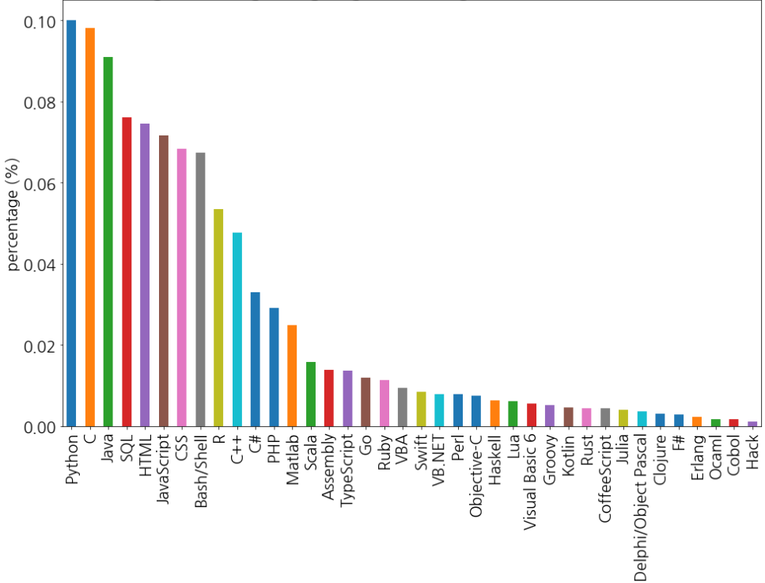
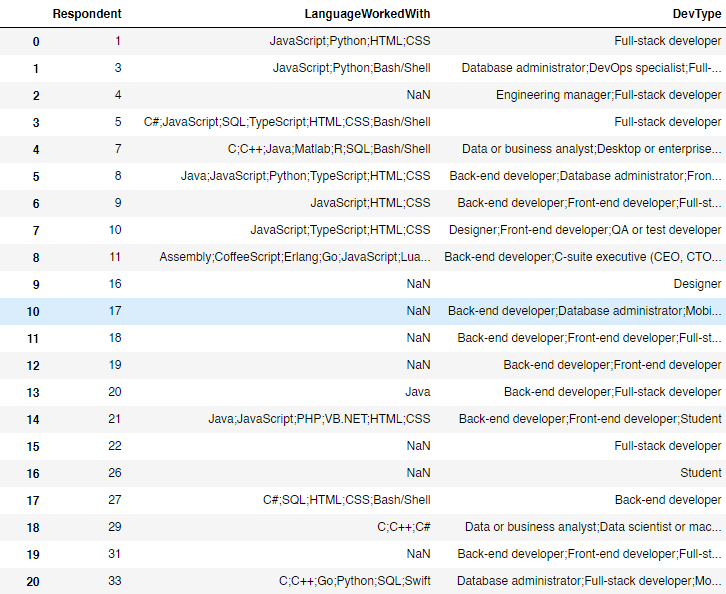
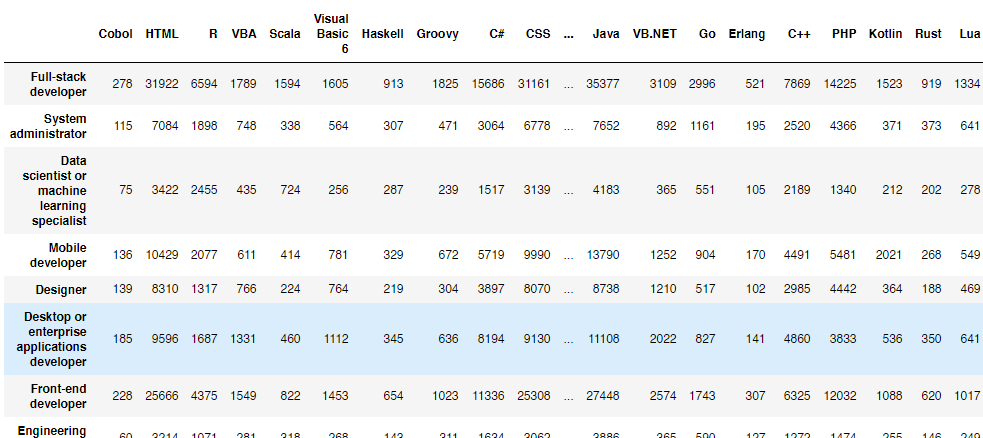
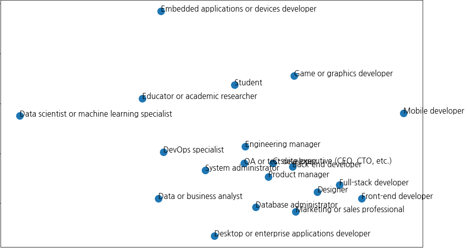
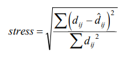

# What language Data Scientist use most?  (from 2018 Stack Overflow Developer Survey )

(survey from total about 100000 users)

### Programming Language Ranking ( Data scientist or machine learning specialist)

### Data shape

Respondents can choose several programming languages. (among 37 programming languages)

Respondents can also choose several Dev types. (among 20 Dev types)

After Preprocessing, data became tabular type.

# How similar different developers each other in terms of their programming language?

#### We can plot on 2D space by using MDS(multi dimensional scaling )

what is MDS?

Simply say,  MDS is one of dimensionality reduction algorithm that enable to plot multidimensional data into 2-D or higher dimensional space.

**MDS find desire points that minimize stress loss. MDS fits with stress values near zero are the best.**

 ( Here, dij is actual distance and ||xi-xj|| is predicted distance ( 2D in this example) )

